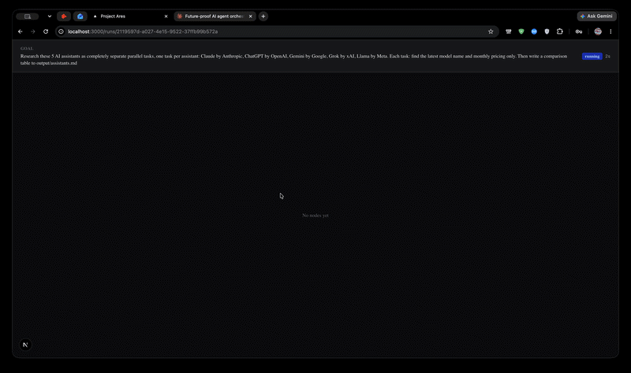

# Ares

> A local-first multi-agent execution platform. Submit a natural language goal and watch a live DAG of AI agents execute it in parallel — fully on your machine, zero cloud costs.



## What it does

Ares takes a natural language goal, calls a local `qwen2.5:3b` model via Ollama to compile it into a directed acyclic graph (DAG), then executes each node using parallel worker agents — all without leaving your laptop.

Every LLM call and tool invocation is traced with OpenTelemetry spans stored in SQLite. You can click any node in the browser UI to see the exact prompt sent, the raw model output, and every tool call made — with latency and status for each step.

After every run, a Critic agent (`phi4-mini`) independently scores the output on factual grounding, goal completion, and tool error rate — producing a combined trust score shown as a badge in the UI. Runs the Critic flags as suspicious automatically append to an eval test suite, so your golden set grows from real failures.

## Demo

Paste this goal to see Ares in action:

```
Research Anthropic, OpenAI, and Mistral AI. Summarize their latest products, identify their
tech stack, and flag which ones compete directly with each other. Write a structured report
to output/competitive_intel.md
```

**What you see:** parallel research nodes firing simultaneously, live token streaming in the DAG canvas, and a trust score badge after the run completes.

## Tech Stack

**Backend:** Python 3.12, FastAPI, LangGraph, LangChain, LangSmith, Pydantic v2, aiosqlite, ChromaDB, OpenTelemetry

**Frontend:** Next.js 15, TypeScript, React Flow, shadcn/ui, Tailwind CSS, Zustand

**Local AI (via Ollama — all free):**
- `qwen2.5:3b` — orchestrator + all worker agents
- `phi4-mini` — critic agent
- `nomic-embed-text` — embeddings

**Web Search:** DuckDuckGo (no API key required)

## Local Setup

1. **Install Ollama:**
   ```bash
   brew install ollama
   ```

2. **Pull the required models:**
   ```bash
   ollama pull qwen2.5:3b
   ollama pull phi4-mini
   ollama pull nomic-embed-text
   ```

3. **Clone the repo and enter the directory:**
   ```bash
   git clone <repo-url> && cd ares
   ```

4. **Copy the example env file** (no keys required for basic usage):
   ```bash
   cp .env.example .env
   ```

5. **Create and activate a virtual environment:**
   ```bash
   python -m venv venv
   source venv/bin/activate
   ```

6. **Install Python dependencies:**
   ```bash
   pip install -e .
   ```

7. **Start the backend:**
   ```bash
   python -m uvicorn backend.main:app --reload
   ```

8. **Start the frontend:**
   ```bash
   cd frontend && npm install && npm run dev
   ```

9. **Open** [http://localhost:3000](http://localhost:3000)

## Project Structure

```
backend/
  agents/       # Compiler, Worker, Critic LangGraph agents
  store/        # SQLite repos (runs, nodes, traces)
  tracing/      # OpenTelemetry exporter and middleware
  tools/        # web_search, code_exec, file_ops, http_get
  api/          # FastAPI routers (runs, traces, replay)
frontend/
  app/          # Next.js app router pages
  components/   # DagCanvas, TraceSidebar, RunList, NewRunForm
output/         # Agent-written files land here (gitignored)
```

## How It Works

A submitted goal hits the **DAG Compiler** (qwen2.5:3b), which returns a typed plan; LangGraph then schedules and executes each node in parallel using **Worker agents** that have access to web search, code execution, file I/O, and HTTP tools; every step emits **OpenTelemetry spans** stored in SQLite and streamed to the React Flow canvas via SSE; once all nodes settle, the **Critic agent** scores the run and writes a trust verdict back to the database.

## Eval Harness

A golden set of 5 eval cases lives in `backend/tests/evals/golden_set.py`; Critic-flagged spans are automatically appended to `critic_flagged.jsonl` during production runs. Run the full eval suite with:

```bash
pytest backend/tests/evals/ -v -m integration
```

## Why It's Different

- **Observability-first:** every decision is traced at the span level, not just logged — you can replay any run with full prompt/output fidelity
- **Self-improving evals:** failures become test cases automatically, so the eval harness tightens with every bad run
- **Full replay:** retry any failed node from its exact checkpoint state without restarting the entire run
